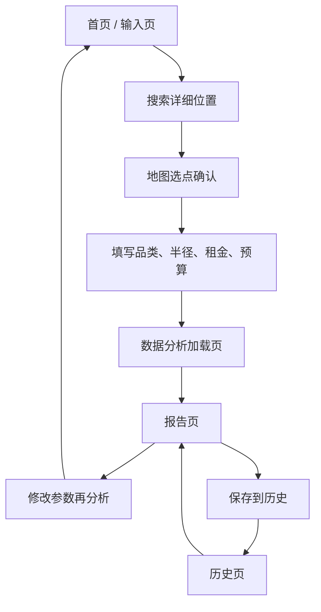
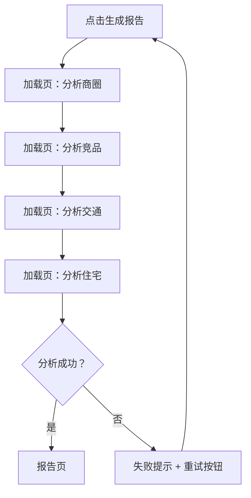
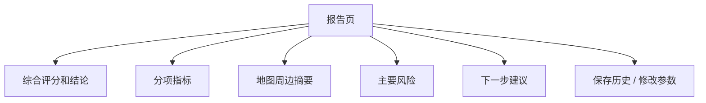

# 第2周页面流程图

## 主流程

```mermaid
flowchart TD
    A["首页 / 输入页"] --> B["搜索详细位置"]
    B --> C["地图选点确认"]
    C --> D["填写品类、半径、租金、预算"]
    D --> E["数据分析加载页"]
    E --> F["报告页"]
    F --> G["修改参数再分析"]
    G --> A
    F --> H["保存到历史"]
    H --> I["历史页"]
    I --> F
```

## 加载与失败流程

```mermaid
flowchart TD
    A["点击生成报告"] --> B["加载页：分析商圈"]
    B --> C["加载页：分析竞品"]
    C --> D["加载页：分析交通"]
    D --> E["加载页：分析住宅"]
    E --> F{"分析成功？"}
    F -->|是| G["报告页"]
    F -->|否| H["失败提示 + 重试按钮"]
    H --> A
```

## 报告页信息结构

```mermaid
flowchart TD
    A["报告页"] --> B["综合评分和结论"]
    A --> C["分项指标"]
    A --> D["地图周边摘要"]
    A --> E["主要风险"]
    A --> F["下一步建议"]
    A --> G["保存历史 / 修改参数"]
```

## 原型点击路径

1. 在输入页点击“搜索详细”确认候选点。
2. 点击低保真地图确认精确点。
3. 点击“生成报告”进入加载页。
4. 加载完成后进入报告页。
5. 点击“修改参数”回到输入页。
6. 点击“保存到历史”后可在历史页查看最近记录。
